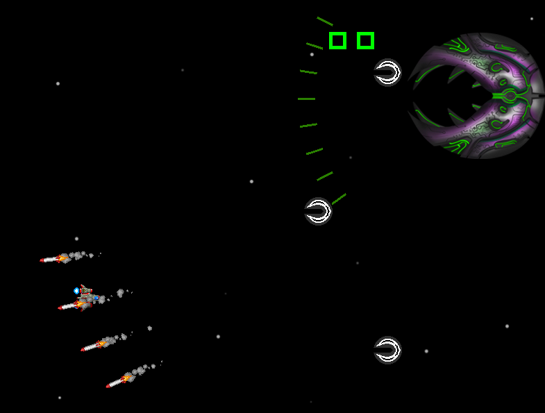

# Simple multithreading lib
Final group project for INE5412 - Operating Systems I, developed with @Brenda-Machado

## Dependencies
Allegro5 was used on the development of the space shooter game, on Ubuntu run:
```shell
sudo apt install liballegro5-dev
```
## Execution
Inside the src directory
```shell
make
./main
```


